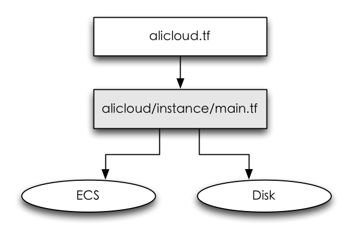
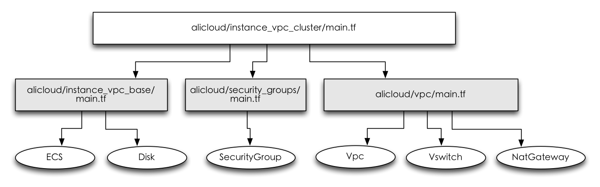

* 中文Readme参见: [https://github.com/alibaba/terraform-alicloud/README_zh.md](https://github.com/alibaba/terraform-alicloud)

# create and setting Alicloud resource used Terraform

* Terraform is a tool for "Infrastructue as code" from HashiCorp. Terraform used Template(*.tf) defined infrastructure, It's provide "AWS/Azure/OpenStack" etc cloud platform. This project is used Terraform to create and setting Alicloud resource.

### Install terraform
* preference: https://www.terraform.io/intro/getting-started/install.html
		
* note: the system path setting on the terraform parent folder. example: if the terraform in the PATH "~/work/terraform_0.7.10", then the path is export PATH=$PATH:~/work/terraform_0.7.10

### Install GoLang SDK
* If you just used template(*.tf), then you don't need to install Go SDK, you can create template or used the template for create resource.
* Create folder for Go running environment, example: ~/work/go
* Download GoLong SDK: http://www.golangtc.com/download 
* GoLang SDK install on mac that will be reference: http://www.tuicool.com/articles/Fv6zUfE
* Setting the PATH and GOPATH, example: 
		
		export PATH=$PATH:/usr/local/go/bin
		export GOPATH="~/work/go"

* Look for a GoLang project and get it, then create the go base directory, such as: go get github.com/denverdino/aliyungo

### How to used project
1. Create the folder "alibaba" in your GoPath, such as "work/go/src/github.com/alibaba". and clone the project.
2. In the "github.com/alibaba/terraform-alicloud" directory execute following command:
		
		 "go get ./..." //this will download depend package
		 "make all"
		 "terraform get"
		 "terraform plan" //input the tips parameters, such as access_key, secret_key , or zone, ecs instance name etc.
		 "terraform apply"
		 
3. or used export setting parameters below:

		export ALICLOUD_ACCESS_KEY=*** 
		export ALICLOUD_SECRET_KEY=***
		terraform get
		terraform plan
		terraform apply
		terraform destroy
		...
		
* note: if you want to used template from this project, you can create tempate and run "terraform plan" etc commands, the template content you can refrence the "Folder description".

### Folder description

* notice: if you will run the special *.tf file, need enter the folder, then run "terraform get" etc commands.

* 1.The /alicloud.tf file is Terraform template for Terraform module, It's link source to terraform/alicloud/instance/main.tf, so run the template(.tf) will create the instance of classic web, if update the zone or region etc parameters, then create instance used the updated parameters. the commands such as
	
		terraform get
		terraform plan
		terraform apply

* 2.The terraform/alicloud/instanc_vpc_cluster/main.tf will create the VPC cluster, include ECS\VPC\Vswitch\NetGateWay\SecurityGroup.

* 3.The terraform/alicloud/instance_slb/main.tf will create SLB and ECS Instance.

### How to contribute code
* We expect contribute the code in this repository for aliyun production and the terraform template, you have pull request it.

### Contributors
* heww(heww0205@gmail.com)
* ShuWei(shuwei.yin@alibaba-inc.com)
* wangyuelucky(wangyuelucky@126.com)
* GuiMin(guimin.hgm@alibaba-inc.com)

### License
* This project is licensed under the Apache License, Version 2.0. See [LICENSE](https://github.com/denverdino/aliyungo/blob/master/LICENSE.txt) for the full license text.

### Refrence
* Terraform document: https://www.terraform.io/intro/
